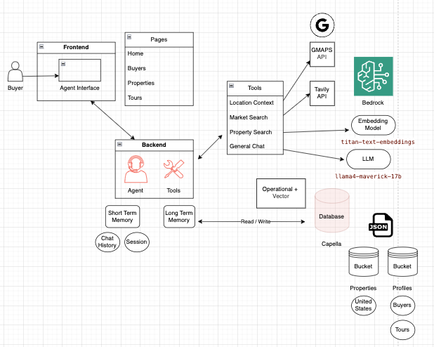

# agent-on-capella
An agentic real-estate search experience on Couchbase Capella that personalizes property discovery with vector search and long‑term memory.

## Diagram
 
 - [Source (`agent-on-capella.drawio`)](agent-on-capella.drawio)

---

## Overview
This project demonstrates how Capella’s unified platform enables fast, intelligent, and personalized online buying experiences by combining:
- **Vector similarity search** for semantic property matching.
- **Long‑term memory** of user preferences, saved homes, and scheduled tours.
- **Tool routing** to the best capability per request (LLM, vector index, geospatial, and web search).

## Features
- **Personalized discovery** using embeddings-powered search.
- **Long‑term memory** of:
  - Available properties
  - Buyer preferences
  - Saved properties
  - Scheduled tours
- **Multi‑tool routing** for general Q&A, semantic search, geospatial lookups, and real‑time web trends.

## Architecture
Single-agent pattern that routes user requests to the optimal tool.

### Routes
1. **Direct to LLM** — `us.meta.llama4-maverick-17b-instruct-v1:0` for general questions (e.g., mortgage approval).
2. **CB Vector Search Tool** — cosine similarity on text embeddings to find relevant properties.
3. **Gmaps API / Geospatial Search** — uses property latitude/longitude to find nearby schools and restaurants.
4. **Realtime Web Search (Tavily API)** — current market trends and average prices.

## Models
- **Text Embeddings:** Titan Text Embeddings V2 (1024 dimensions). Similarity: Cosine.
- **LLM:** `us.meta.llama4-maverick-17b-instruct-v1:0`.

## Vector Index
- Cosine similarity
- 1024 dimensions

## Data Model (Couchbase Capella)
- **Bucket:** `properties`
  - **Scope:** `2025-listings`
  - **Collection:** `united-states`

- **Bucket:** `profiles`
  - **Scope:** `buyers`
  - **Collection:** `2025`

- **Bucket:** `profiles`
  - **Scope:** `tours`
  - **Collection:** `2025`

## Reference
- [Write-up: Search your dream property — building an agentic app on Capella (LinkedIn)](https://www.linkedin.com/pulse/search-dream-property-building-agentic-app-capella-jacob-wood-jmgmc/)
